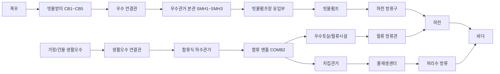

# Urban Flood SWMM Pilot

서울 도시침수 과제용 SWMM 파일입니다.

이 저장소는 Windows PC에서 EPA SWMM GUI로 모델을 열고, 빗물받이·우수 본관·빗물펌프장·하천 방류구·합류식 하수관거·우수토실/월류시설·물재생센터 흐름을 확인할 수 있도록 구성했습니다.

## 바로 실행할 파일

| 파일 | 용도 |
|---|---|
| `models/seoul_pilot_base.inp` | 기본 폭우 시나리오 |
| `models/seoul_pilot_backflow.inp` | 하천 수위 상승/역류 시나리오 |
| `viewer/urban_flood_network_viewer.html` | 브라우저에서 보는 시뮬레이션 플레이백 화면 |
| `sample-results/virtual_sensor_summary.csv` | 센서별 최대 수위·유량·유속 요약 |
| `sample-results/problem_events.csv` | 침수/역류 후보 이벤트 요약 |
| `Run_SWMM_Base.bat` | Windows에서 기본 폭우 시나리오를 실제 계산 실행 |
| `Run_SWMM_Backflow.bat` | Windows에서 하천 역류 시나리오를 실제 계산 실행 |
| `Open_Network_Viewer.bat` | 브라우저 플레이백 화면 열기 |

## Windows에서 SWMM GUI로 여는 방법

1. Windows PC에 EPA SWMM을 설치합니다.
2. 이 저장소를 ZIP으로 받거나 Git으로 clone합니다.
3. EPA SWMM을 실행합니다.
4. `File > Open`에서 아래 파일 중 하나를 엽니다.
   - `models/seoul_pilot_base.inp`
   - `models/seoul_pilot_backflow.inp`
5. 실행 버튼을 눌러 시뮬레이션을 돌립니다.
6. 실행 후 리포트, 노드/관 그래프, 프로파일 플롯을 확인합니다.

자세한 설명은 `docs/windows_import_guide.md`를 보면 됩니다.

## 실제 시뮬레이션 실행과 보기 화면의 차이

실제 계산은 EPA SWMM에서 합니다.

```text
EPA SWMM GUI
→ models/seoul_pilot_base.inp 열기
→ Project > Run Simulation
→ 결과 리포트/그래프 확인
```

또는 Windows에서 아래 배치 파일을 실행할 수도 있습니다.

```text
Run_SWMM_Base.bat
Run_SWMM_Backflow.bat
```

이 배치 파일은 Windows에 설치된 `runswmm.exe`를 찾아서 실제 SWMM 계산을 실행하고, 결과를 `run-results/` 폴더에 저장합니다.

브라우저 화면은 계산 엔진이 아니라 보기 화면입니다.

```text
Open_Network_Viewer.bat
```

이 파일은 `sample-results/`에 저장된 SWMM 실행 결과 CSV를 시간순으로 재생해서, 물이 어디서 차고 어디서 역류 후보가 생기는지 눈으로 보기 쉽게 보여줍니다.

## import하면 어느 정도 이미지화되나?

SWMM GUI에서 `.inp`를 열면 노드와 관이 연결된 2D 네트워크 도식으로 보입니다.

볼 수 있는 것:

- 빗물받이, 맨홀, 저장조, 방류구 같은 노드 위치
- 우수 연결관, 우수 본관, 차집관거, 월류 방류관, 펌프 토출관 같은 연결선
- 펌프와 월류시설이 어느 지점에 붙어 있는지
- 실행 후 시간대별 수위, 유량, 유속, 침수 리포트
- 관로 프로파일 그래프

볼 수 없는 것:

- 실제 서울 지도 위 GIS 형태
- 3D 지하 배관 모델
- 실제 맨홀/빗물받이 사진처럼 생긴 이미지
- 센서 대시보드 형태의 화면

즉 SWMM GUI는 “수리해석용 2D 관망도”에 가깝고, 발표용으로 직관적인 그림은 `viewer/urban_flood_network_viewer.html` 또는 `Open_Network_Viewer.bat`를 여는 쪽이 더 좋습니다.

## 현재 설계된 흐름



## 이번 샘플 결과 핵심

- 기본 폭우에서는 `CB3` 빗물받이와 `CB3_CONN` 연결관에서 병목/침수 신호가 먼저 발생했습니다.
- 하천 역류 시나리오에서는 `OVF_PIPE`, `PUMP_FORCE_OUT`에서 역류 후보가 추가로 발생했습니다.
- `CSO_WEIR`는 현재 강우 조건에서는 실제 월류가 크게 발생하지 않습니다. 월류시설 작동 시나리오를 보려면 합류식 유입량을 키우거나 차집/처리 용량을 낮춘 별도 시나리오가 필요합니다.

## 폴더 구조

```text
models/
  seoul_pilot_base.inp
  seoul_pilot_backflow.inp

viewer/
  urban_flood_network_viewer.html

sample-results/
  virtual_sensor_readings_base.csv
  virtual_sensor_readings_backflow.csv
  virtual_sensor_summary.csv
  problem_events.csv

docs/
  windows_import_guide.md
  connection_structure.md
  result_summary.md

Run_SWMM_Base.bat
Run_SWMM_Backflow.bat
Open_Network_Viewer.bat
```
